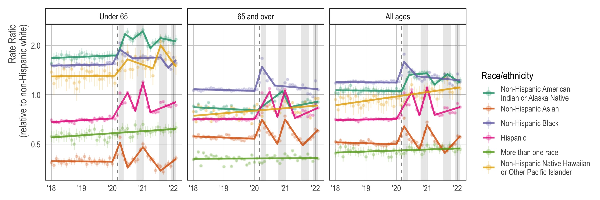

<!-- README.md is generated from README.Rmd. Please edit that file -->

```{r, include = FALSE}
knitr::opts_chunk$set(
  collapse = TRUE,
  comment = "#>"
)
```

<!-- badges: start -->
<!-- badges: end -->

## Dynamics of racial disparities in all-cause mortality during the COVID-19 pandemic

```{r echo=FALSE, out.width = "750px", fig.align='center'}

```


This is reproducible code and data for our forthcoming paper, *Dynamics of racial disparities in all-cause mortality during the COVID-19 pandemic*, which uses the [CDC WONDER provisional data](https://wonder.cdc.gov/mcd.html) to estimate monthly age-standardized mortality rates and rate ratios. We use the [NCI Joinpoint Regression Program](https://surveillance.cancer.gov/joinpoint/) to fit segmented regressions (joinpoint models) on trends in rate ratios and age-standardized mortality rates. The full citation is: 

> TODO

### Abstract

TODO

## Reproducibility 

All analyses are conducted using `R`, which can be [downloaded via CRAN](https://cran.r-project.org/). 
We also recommend the use of [RStudio](https://www.rstudio.com/products/rstudio/download/) when running `R`, which will allow users to take advantage of [`renv`](https://rstudio.github.io/renv/index.html) for dependency management. If not using
`renv`, we provide session information at the end of this file to ensure packages are
the correct version. Note that for the joinpoint analyses, you must use an external program, [Joinpoint Regression Program](https://surveillance.cancer.gov/joinpoint/) which can be downloaded from the National Cancer Institute website. 

We use publicly available data — the `README.md` file in `data_raw` has links to our CDC WONDER query and each query file has the dates of data access. 

The code files (in `code`) are designed to be run in order. Files `01` to `04` manipulate the 
raw data into files that can be run in the Joinpoint regression program. After running these files, one must run joinpoint analyses in Joinpoint Regression Program. For convenience, we have provided our saved analysis settings (files ending in `.jps`) as well as our model results (files ending in `.jpo`). Once files have been exported out of the Joinpoint Regression Program, one can run code files `05` and higher to gather the results and create plots. 

## Figure data

The numeric representations of the figures in our paper are available in `output`. 

## Authors (alphabetical)

-   [Hélène Aschmann](https://profiles.ucsf.edu/helene.aschmann) 
    (:
    [heleneaschmann](https://github.com/heleneaschmann) \|
    (: 
    [\@LnAschmann](https://twitter.com/LnAschmann))
-   [Kirsten Bibbins-Domingo](https://profiles.ucsf.edu/kirsten.bibbins-domingo)
    (:
    [\@KBibbinsDomingo](https://twitter.com/KBibbinsDomingo))
-   [Ruijia Chen](https://profiles.ucsf.edu/ruijia.chen)
    (:
    [2018Ruijia](https://github.com/2018Ruijia) \|
    :
    [\@RuijiaChen19](https://twitter.com/@RuijiaChen19))
-   [Yea-Hung Chen](https://yea-hung.rbind.io)
    (:
    [yea-hung](https://github.com/yea-hung) \|
    :
    [\@ch272n](https://twitter.com/ch272n))
-   [Maria Glymour](https://profiles.ucsf.edu/maria.glymour)
    (:
    [\@MariaGlymour](https://twitter.com/MariaGlymour))
-   [Mathew Kiang](https://mathewkiang.com) 
    (: 
    [mkiang](https://github.com/mkiang) \| 
    : 
    [\@mathewkiang](https://twitter.com/mathewkiang))
-   [Alicia Riley](http://www.arriley.com)
    (: 
    [aliciarr](https://github.com/aliciarr) \| 
    : 
    [\@aliciacita](https://twitter.com/aliciacita))
-   [Andrew Stokes](https://www.bu.edu/sph/profile/andrew-stokes/) 
    (: 
    [\@astokespop](https://twitter.com/astokespop))


## Session information
```{r, eval = FALSE}
> sessioninfo::session_info()
─ Session info ─────────────────────────────────────────────────────────
 setting  value
 version  R version 4.1.0 (2021-05-18)
 os       macOS 12.4
 system   x86_64, darwin17.0
 ui       RStudio
 language (EN)
 collate  en_US.UTF-8
 ctype    en_US.UTF-8
 tz       America/Los_Angeles
 date     2022-07-18
 rstudio  2022.02.1+461 Prairie Trillium (desktop)
 pandoc   2.17.1.1 @ /Applications/RStudio.app/Contents/MacOS/quarto/bin/ (via rmarkdown)

─ Packages ─────────────────────────────────────────────────────────────
 package     * version date (UTC) lib source
 assertthat    0.2.1   2019-03-21 [2] CRAN (R 4.1.0)
 backports     1.4.1   2021-12-13 [2] CRAN (R 4.1.0)
 broom         0.8.0   2022-04-13 [2] CRAN (R 4.1.2)
 cellranger    1.1.0   2016-07-27 [2] CRAN (R 4.1.0)
 cli           3.3.0   2022-04-25 [2] CRAN (R 4.1.2)
 colorspace    2.0-3   2022-02-21 [2] CRAN (R 4.1.2)
 crayon        1.5.1   2022-03-26 [2] CRAN (R 4.1.2)
 DBI           1.1.2   2021-12-20 [2] CRAN (R 4.1.0)
 dbplyr        2.1.1   2021-04-06 [2] CRAN (R 4.1.0)
 digest        0.6.29  2021-12-01 [2] CRAN (R 4.1.0)
 dplyr       * 1.0.9   2022-04-28 [2] CRAN (R 4.1.2)
 ellipsis      0.3.2   2021-04-29 [2] CRAN (R 4.1.0)
 evaluate      0.15    2022-02-18 [2] CRAN (R 4.1.2)
 fansi         1.0.3   2022-03-24 [2] CRAN (R 4.1.2)
 fastmap       1.1.0   2021-01-25 [2] CRAN (R 4.1.0)
 forcats     * 0.5.1   2021-01-27 [2] CRAN (R 4.1.0)
 fs            1.5.2   2021-12-08 [2] CRAN (R 4.1.0)
 generics      0.1.2   2022-01-31 [2] CRAN (R 4.1.2)
 ggplot2     * 3.3.6   2022-05-03 [2] CRAN (R 4.1.2)
 glue          1.6.2   2022-02-24 [2] CRAN (R 4.1.2)
 gtable        0.3.0   2019-03-25 [2] CRAN (R 4.1.0)
 haven         2.5.0   2022-04-15 [2] CRAN (R 4.1.2)
 here        * 1.0.1   2020-12-13 [2] CRAN (R 4.1.0)
 hms           1.1.1   2021-09-26 [2] CRAN (R 4.1.0)
 htmltools     0.5.2   2021-08-25 [2] CRAN (R 4.1.0)
 httr          1.4.3   2022-05-04 [2] CRAN (R 4.1.2)
 janitor     * 2.1.0   2021-01-05 [2] CRAN (R 4.1.0)
 jsonlite      1.8.0   2022-02-22 [2] CRAN (R 4.1.2)
 knitr         1.39    2022-04-26 [2] CRAN (R 4.1.2)
 lattice       0.20-45 2021-09-22 [2] CRAN (R 4.1.0)
 lifecycle     1.0.1   2021-09-24 [2] CRAN (R 4.1.0)
 lubridate     1.8.0   2021-10-07 [2] CRAN (R 4.1.0)
 magrittr      2.0.3   2022-03-30 [2] CRAN (R 4.1.2)
 modelr        0.1.8   2020-05-19 [2] CRAN (R 4.1.0)
 munsell       0.5.0   2018-06-12 [2] CRAN (R 4.1.0)
 narcan      * 0.1.1   2022-03-28 [2] Github (mkiang/narcan@a9c3d53)
 pillar        1.7.0   2022-02-01 [2] CRAN (R 4.1.2)
 pkgconfig     2.0.3   2019-09-22 [2] CRAN (R 4.1.0)
 purrr       * 0.3.4   2020-04-17 [2] CRAN (R 4.1.0)
 R6            2.5.1   2021-08-19 [2] CRAN (R 4.1.0)
 readr       * 2.1.2   2022-01-30 [2] CRAN (R 4.1.2)
 readxl        1.4.0   2022-03-28 [2] CRAN (R 4.1.2)
 renv          0.15.5  2022-05-26 [1] CRAN (R 4.1.2)
 reprex        2.0.1   2021-08-05 [2] CRAN (R 4.1.0)
 rlang         1.0.2   2022-03-04 [2] CRAN (R 4.1.2)
 rmarkdown     2.14    2022-04-25 [2] CRAN (R 4.1.2)
 rprojroot     2.0.3   2022-04-02 [2] CRAN (R 4.1.2)
 rsconnect     0.8.25  2021-11-19 [2] CRAN (R 4.1.0)
 rstudioapi    0.13    2020-11-12 [2] CRAN (R 4.1.0)
 rvest         1.0.2   2021-10-16 [2] CRAN (R 4.1.0)
 scales        1.2.0   2022-04-13 [2] CRAN (R 4.1.2)
 sessioninfo   1.2.2   2021-12-06 [2] CRAN (R 4.1.0)
 snakecase     0.11.0  2019-05-25 [2] CRAN (R 4.1.0)
 stringi       1.7.6   2021-11-29 [2] CRAN (R 4.1.0)
 stringr     * 1.4.0   2019-02-10 [2] CRAN (R 4.1.0)
 tibble      * 3.1.7   2022-05-03 [2] CRAN (R 4.1.2)
 tidyr       * 1.2.0   2022-02-01 [2] CRAN (R 4.1.2)
 tidyselect    1.1.2   2022-02-21 [2] CRAN (R 4.1.2)
 tidyverse   * 1.3.1   2021-04-15 [2] CRAN (R 4.1.0)
 tzdb          0.3.0   2022-03-28 [2] CRAN (R 4.1.0)
 utf8          1.2.2   2021-07-24 [2] CRAN (R 4.1.0)
 vctrs         0.4.1   2022-04-13 [2] CRAN (R 4.1.2)
 withr         2.5.0   2022-03-03 [2] CRAN (R 4.1.2)
 xfun          0.31    2022-05-10 [2] CRAN (R 4.1.2)
 xml2          1.3.3   2021-11-30 [2] CRAN (R 4.1.0)
 yaml          2.3.5   2022-02-21 [2] CRAN (R 4.1.2)
 zoo           1.8-10  2022-04-15 [2] CRAN (R 4.1.2)

 [1] /Users/mvk/Library/CloudStorage/Dropbox/Projects_Active/dynamic_inequality/renv/library/R-4.1/x86_64-apple-darwin17.0
 [2] /Library/Frameworks/R.framework/Versions/4.1/Resources/library

────────────────────────────────────────────────────────────────────────
```
